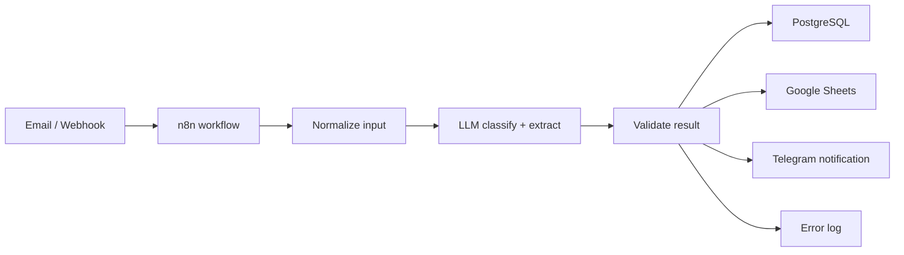

# n8n RFQ / Lead Processing Assistant

Self-hosted automation project for processing inbound business inquiries and RFQ requests with n8n, PostgreSQL, Google Sheets, Telegram notifications, and an OpenAI-compatible LLM.

Current stage: base Docker infrastructure and PostgreSQL schema. n8n workflow JSON, credentials, prompts, and external integrations will be added later.

## Purpose

Businesses receive inquiries through email, website forms, messengers, and CRM channels. These messages are usually unstructured: a manager has to read them manually, copy contact details, understand the request, update a table or CRM, and remember to follow up.

This project will automate the first processing step:

```text
incoming message
-> normalize
-> classify with LLM
-> extract structured fields
-> validate
-> save to PostgreSQL
-> sync to Google Sheets
-> notify manager in Telegram
```

## Stack

- n8n self-hosted as the workflow orchestrator
- Docker Compose for local/self-hosted deployment
- PostgreSQL as the persistent storage layer
- Google Sheets as a future human-readable view
- Telegram Bot API for future manager notifications
- OpenAI-compatible LLM API for future classification and extraction
- IMAP/email trigger and webhook trigger as future inputs

## Infrastructure

The project uses two Docker containers:

```text
n8n-leadflow
  ├─ n8n
  └─ postgres
```

The PostgreSQL container stores one database for the MVP:

```text
postgres container
  └─ leadflow
      ├─ n8n internal tables
      └─ project tables: inquiries, events, processing errors
```

For the first MVP this keeps the setup easy to understand: the whole project uses one PostgreSQL database named `leadflow`. A future production version may split n8n internal state and business data into separate databases or schemas.

## Quick Start

Create a local environment file:

```bash
cp .env.example .env
```

Edit `.env` and replace placeholder secrets, especially:

```text
POSTGRES_PASSWORD
N8N_ENCRYPTION_KEY
```

Start the infrastructure:

```bash
docker compose up -d
```

Open n8n:

```text
http://localhost:5678
```

Check containers:

```bash
docker compose ps
```

Validate the Compose configuration:

```bash
docker compose config
```

## Database Schema

Business tables are defined in [db/schema.sql](./db/schema.sql).

The schema creates:

- `inquiries` - inbound messages and AI extraction results
- `inquiry_events` - status changes and processing history
- `processing_errors` - workflow and integration failures

The schema uses `jsonb` fields for flexible data such as raw payloads, validation flags, metadata, and error context.

PostgreSQL initialization files:

- [db/schema.sql](./db/schema.sql) creates project tables inside the `leadflow` database.

Initialization scripts run only when the PostgreSQL data volume is created for the first time. If the volume already exists, reset it manually before expecting init scripts to rerun.

## Planned MVP Workflow

The first n8n workflow should demonstrate one clean end-to-end business process:

1. Receive an inquiry through webhook or email.
2. Normalize the source payload into a common internal format.
3. Send the message text to an LLM.
4. Classify the inquiry as RFQ, question, spam, or manual review.
5. Extract fields such as name, company, contact details, product/service, quantity, deadline, and comment.
6. Validate required fields and assign a processing status.
7. Store the full record in PostgreSQL.
8. Add or sync a row in Google Sheets.
9. Send a Telegram notification to the manager.
10. Log processing errors for troubleshooting.

## Target Workflow



## Expected Inquiry Fields

The system is expected to extract and store fields like:

- source
- received_at
- raw_subject
- raw_body
- classification
- confidence
- status
- name
- company
- email
- phone
- product_or_service
- quantity
- deadline
- summary
- validation_flags
- manager_comment

## Planned Statuses

- `new` - valid commercial inquiry ready for manager review
- `accepted` - manager accepted the inquiry for further work
- `needs_clarification` - useful inquiry, but key details are missing
- `manual_review` - AI or validation is uncertain
- `rejected` - spam, duplicate, irrelevant, or not suitable

## Repository Structure

```text
n8n-leadflow/
  docker-compose.yaml
  .env.example
  README.md
  db/
    schema.sql
```

Planned later:

```text
workflows/
  rfq-lead-processing.workflow.json
  error-handler.workflow.json
prompts/
  extraction-prompt.md
examples/
  sample-email-rfq.txt
  sample-webhook-payload.json
  sample-llm-response.json
docs/
  screenshots/
```

## Not Included Yet

The current infrastructure does not include:

- n8n workflow JSON
- n8n credentials
- Google Sheets integration
- Telegram integration
- IMAP/email integration
- LLM prompt and HTTP request node
- Bitrix24 or amoCRM integration

Those pieces will be added after the infrastructure and data model are stable.

## Architecture Notes

PostgreSQL is the source of truth for project data. Google Sheets is planned as a convenient demo and manager-facing view, not the primary database.

n8n orchestrates the process, but does not define the data model. Business records, statuses, raw messages, validation flags, and processing errors live in PostgreSQL.

LLM output should be validated by deterministic rules before being trusted. The AI layer is responsible for language understanding; the validation layer is responsible for process safety.

Architecture notes and product reasoning are stored locally in `MODEL.md`; that file is intentionally ignored by git.
